# Database Entity Relationship Diagram (ERD)

This document provides a visual representation of the database schema and relationships.

## ERD Diagram (Mermaid)

```mermaid
erDiagram
    USERS {
        int id PK
        string userId UK
        string name
        string email UK
        enum role
        string team
        enum department
        boolean isActive
        datetime createdAt
        datetime updatedAt
    }

    SUPPLIERS {
        int id PK
        string supplierId UK
        string name
        text address
        string city
        string state
        string country
        string email
        string phone
        string gstin
        string sourceOfSupply
        jsonb specialties
        decimal rating
        date lastOrderDate
        boolean isActive
        text notes
        datetime createdAt
        datetime updatedAt
    }

    MATERIALS {
        int id PK
        string itemId UK
        string itemName
        string sku
        string upc
        boolean isReturnableItem
        string hsnSac
        string dimensionUnit
        string weightUnit
        boolean isReceivableService
        boolean taxable
        string taxabilityType
        string productType
        string categoryName
        string parentCategory
        string intraStateTaxName
        decimal intraStateTaxRate
        string intraStateTaxType
        string interStateTaxName
        decimal interStateTaxRate
        string interStateTaxType
        string source
        string referenceId
        datetime lastSyncTime
        string status
        string usageUnit
        string unitName
        string defaultSalesUnitName
        string defaultSalesUnitSymbol
        string defaultPurchaseUnitName
        string defaultPurchaseUnitSymbol
        string inventoryAccount
        string inventoryAccountCode
        string inventoryValuationMethod
        int reorderPoint
        string vendor
        int supplierId FK
        string warehouseName
        int openingStock
        decimal openingStockValue
        int stockOnHand
        string itemType
        datetime createdAt
        datetime updatedAt
    }

    ORDERS {
        int id PK
        string orderId UK
        datetime createdAt
        jsonb createdBy
        jsonb customer
        jsonb supplier
        string materialName
        jsonb materials
        jsonb quantity
        jsonb priceToCustomer
        jsonb priceFromSupplier
        enum status
        jsonb documents
        jsonb advancePayment
        jsonb auditLogs
        jsonb comments
        jsonb assignedTo
        jsonb approvalRequests
        jsonb timeline
        string poNumber
        string deliveryTerms
        string incoterms
        string eta
        text notes
        jsonb freightHandler
        string hsnCode
        string enquiryNo
        string upc
        string ean
        string mpn
        string isbn
        string inventoryAccount
        string inventoryValuationMethod
        boolean supplierPOGenerated
        boolean supplierPOSent
        jsonb paymentDetails
        string rfid
        enum entity
        enum orderType
        string logisticsSubStatus
        jsonb logisticsDocuments
        jsonb discount
        jsonb tds
        jsonb tcs
        decimal adjustment
        datetime updatedAt
    }

    %% Relationships
    MATERIALS ||--o{ SUPPLIERS : "belongs to (supplierId)"
    SUPPLIERS ||--o{ MATERIALS : "has many"
    
    %% Note: Order-Supplier relationship is currently JSONB
    %% Can be enhanced with foreign key if needed:
    %% ORDERS }o--|| SUPPLIERS : "belongs to (supplierId)"
    
    %% Note: Order-Materials relationship is currently JSONB
    %% Can be enhanced with junction table if needed:
    %% ORDERS }o--o{ MATERIALS : "contains (via junction table)"
```



## Text-Based ERD

```
┌─────────────────────────────────────────────────────────────────┐
│                           USERS                                 │
├─────────────────────────────────────────────────────────────────┤
│ PK │ id                    │ INTEGER                            │
│ UK │ userId                │ STRING                            │
│ UK │ email                 │ STRING                            │
│    │ name                  │ STRING                            │
│    │ role                  │ ENUM (Employee, Manager, Management)│
│    │ team                  │ STRING                            │
│    │ department            │ ENUM (CRM, Finance, Logistics, Management)│
│    │ isActive              │ BOOLEAN                           │
│    │ createdAt             │ DATETIME                          │
│    │ updatedAt              │ DATETIME                          │
└─────────────────────────────────────────────────────────────────┘

┌─────────────────────────────────────────────────────────────────┐
│                         SUPPLIERS                               │
├─────────────────────────────────────────────────────────────────┤
│ PK │ id                    │ INTEGER                            │
│ UK │ supplierId            │ STRING                            │
│    │ name                  │ STRING                            │
│    │ address                │ TEXT                              │
│    │ city                   │ STRING                            │
│    │ state                  │ STRING                            │
│    │ country                │ STRING                            │
│    │ email                  │ STRING                            │
│    │ phone                  │ STRING                            │
│    │ gstin                  │ STRING                            │
│    │ sourceOfSupply         │ STRING                            │
│    │ specialties            │ JSONB (Array)                     │
│    │ rating                 │ DECIMAL(3,2)                      │
│    │ lastOrderDate          │ DATE                              │
│    │ isActive               │ BOOLEAN                           │
│    │ notes                  │ TEXT                              │
│    │ createdAt              │ DATETIME                          │
│    │ updatedAt              │ DATETIME                          │
└─────────────────────────────────────────────────────────────────┘
         │
         │ 1
         │
         │ has many
         │
         ▼
┌─────────────────────────────────────────────────────────────────┐
│                         MATERIALS                               │
├─────────────────────────────────────────────────────────────────┤
│ PK │ id                    │ INTEGER                            │
│ UK │ itemId               │ STRING                            │
│ FK │ supplierId           │ INTEGER → suppliers.id             │
│    │ itemName             │ STRING                            │
│    │ sku                  │ STRING                            │
│    │ upc                  │ STRING                            │
│    │ isReturnableItem     │ BOOLEAN                           │
│    │ hsnSac               │ STRING                            │
│    │ dimensionUnit        │ STRING                            │
│    │ weightUnit           │ STRING                            │
│    │ isReceivableService  │ BOOLEAN                           │
│    │ taxable              │ BOOLEAN                           │
│    │ taxabilityType       │ STRING                            │
│    │ productType          │ STRING                            │
│    │ categoryName         │ STRING                            │
│    │ parentCategory       │ STRING                            │
│    │ intraStateTaxName    │ STRING                            │
│    │ intraStateTaxRate    │ DECIMAL(5,2)                       │
│    │ intraStateTaxType    │ STRING                            │
│    │ interStateTaxName    │ STRING                            │
│    │ interStateTaxRate    │ DECIMAL(5,2)                       │
│    │ interStateTaxType    │ STRING                            │
│    │ source               │ STRING                            │
│    │ referenceId          │ STRING                            │
│    │ lastSyncTime         │ DATETIME                          │
│    │ status               │ STRING                            │
│    │ usageUnit            │ STRING                            │
│    │ unitName             │ STRING                            │
│    │ defaultSalesUnitName │ STRING                            │
│    │ defaultSalesUnitSymbol│ STRING                           │
│    │ defaultPurchaseUnitName│ STRING                          │
│    │ defaultPurchaseUnitSymbol│ STRING                         │
│    │ inventoryAccount     │ STRING                            │
│    │ inventoryAccountCode │ STRING                            │
│    │ inventoryValuationMethod│ STRING                         │
│    │ reorderPoint         │ INTEGER                           │
│    │ vendor               │ STRING                            │
│    │ warehouseName        │ STRING                            │
│    │ openingStock         │ INTEGER                           │
│    │ openingStockValue    │ DECIMAL(10,2)                      │
│    │ stockOnHand         │ INTEGER                           │
│    │ itemType             │ STRING                            │
│    │ createdAt            │ DATETIME                          │
│    │ updatedAt            │ DATETIME                          │
└─────────────────────────────────────────────────────────────────┘

┌─────────────────────────────────────────────────────────────────┐
│                           ORDERS                                 │
├─────────────────────────────────────────────────────────────────┤
│ PK │ id                    │ INTEGER                            │
│ UK │ orderId               │ STRING                            │
│    │ createdAt             │ DATETIME                          │
│    │ createdBy             │ JSONB (User info)                 │
│    │ customer               │ JSONB (ContactInfo)              │
│    │ supplier               │ JSONB (ContactInfo)              │
│    │                       │ [Can be FK to suppliers.id]       │
│    │ materialName           │ STRING                            │
│    │ materials              │ JSONB (Array of MaterialItem)     │
│    │                       │ [Can be junction table]            │
│    │ quantity               │ JSONB (Quantity)                   │
│    │ priceToCustomer        │ JSONB (Price)                     │
│    │ priceFromSupplier      │ JSONB (Price)                     │
│    │ status                 │ ENUM (18 statuses)               │
│    │ documents              │ JSONB (Documents)                  │
│    │ advancePayment         │ JSONB (AdvancePayment)           │
│    │ auditLogs              │ JSONB (Array of AuditLog)         │
│    │ comments               │ JSONB (Array of Comment)          │
│    │ assignedTo             │ JSONB (User info)                 │
│    │ approvalRequests       │ JSONB (Array of ApprovalRequest)  │
│    │ timeline               │ JSONB (Array of TimelineEvent)    │
│    │ poNumber               │ STRING                            │
│    │ deliveryTerms          │ STRING                            │
│    │ incoterms              │ STRING                            │
│    │ eta                    │ STRING                            │
│    │ notes                  │ TEXT                              │
│    │ freightHandler         │ JSONB (FreightHandler)           │
│    │ hsnCode                │ STRING                            │
│    │ enquiryNo              │ STRING                            │
│    │ upc                    │ STRING                            │
│    │ ean                    │ STRING                            │
│    │ mpn                    │ STRING                            │
│    │ isbn                   │ STRING                            │
│    │ inventoryAccount       │ STRING                            │
│    │ inventoryValuationMethod│ STRING                           │
│    │ supplierPOGenerated    │ BOOLEAN                           │
│    │ supplierPOSent         │ BOOLEAN                           │
│    │ paymentDetails         │ JSONB (PaymentDetails)            │
│    │ rfid                   │ STRING                            │
│    │ entity                 │ ENUM (HRV, NHG)                  │
│    │ orderType              │ ENUM (Direct PO, Sample PO, Service PO)│
│    │ logisticsSubStatus     │ STRING                            │
│    │ logisticsDocuments     │ JSONB (LogisticsDocuments)        │
│    │ discount               │ JSONB (Discount)                  │
│    │ tds                    │ JSONB (TDS)                       │
│    │ tcs                    │ JSONB (TCS)                       │
│    │ adjustment             │ DECIMAL(10,2)                     │
│    │ updatedAt              │ DATETIME                          │
└─────────────────────────────────────────────────────────────────┘
```

## Relationship Summary

### Current Relationships

1. **MATERIALS → SUPPLIERS** (Many-to-One)
   - Foreign Key: `materials.supplierId` → `suppliers.id`
   - Relationship: Each material belongs to one supplier
   - Access: `material.supplier` or `material.getSupplier()`
   - Reverse: `supplier.materials` or `supplier.getMaterials()`

### Potential Relationships (Currently JSONB, Can Be Enhanced)

2. **ORDERS → SUPPLIERS** (Many-to-One)
   - Current: Stored as JSONB in `orders.supplier`
   - Potential: Add `orders.supplierId` → `suppliers.id` foreign key
   - Would allow: `order.supplier` (Sequelize relationship)

3. **ORDERS → MATERIALS** (Many-to-Many)
   - Current: Stored as JSONB array in `orders.materials`
   - Potential: Create junction table `order_materials` with:
     - `orderId` → `orders.id`
     - `materialId` → `materials.id`
     - `quantity`, `unitPrice`, `totalPrice` (order-specific material data)
   - Would allow: `order.materials` and `material.orders` (Sequelize relationships)

4. **ORDERS → USERS** (Many-to-One for createdBy/assignedTo)
   - Current: Stored as JSONB in `orders.createdBy` and `orders.assignedTo`
   - Potential: Add `orders.createdById` → `users.id` and `orders.assignedToId` → `users.id`
   - Would allow: `order.creator`, `order.assignee` (Sequelize relationships)

## Relationship Diagram (Visual)

```
┌──────────┐
│  USERS   │
└──────────┘
     │
     │ (createdBy, assignedTo - JSONB)
     │
     ▼
┌──────────┐
│  ORDERS  │
└──────────┘
     │
     │ (supplier - JSONB)
     │ (materials - JSONB array)
     │
     │ [Potential: FK to suppliers]
     │ [Potential: Junction table to materials]
     │
     ▼
┌──────────┐     1:N      ┌──────────┐
│SUPPLIERS │◄─────────────│MATERIALS │
└──────────┘              └──────────┘
     │
     │ (supplier - JSONB in orders)
     │
     └─────────────────────┐
                           │
                           ▼
                    ┌──────────┐
                    │  ORDERS   │
                    └──────────┘
```

## Indexes

### Users Table
- Primary Key: `id`
- Unique: `userId`, `email`
- Index: `email` (for login lookups)

### Suppliers Table
- Primary Key: `id`
- Unique: `supplierId`
- Indexes: `name`, `gstin`, `country`, `isActive`, `sourceOfSupply`

### Materials Table
- Primary Key: `id`
- Unique: `itemId`
- Indexes: `itemName`, `sku`, `hsnSac`, `supplierId`, `vendor`, `status`, `categoryName`

### Orders Table
- Primary Key: `id`
- Unique: `orderId`
- Indexes: `status`, `entity`, `createdAt`
- Note: GIN indexes can be added for JSONB fields if needed

## Notes

1. **JSONB Fields**: Many relationships are currently stored as JSONB for flexibility. These can be converted to proper foreign keys and junction tables if needed for better data integrity and query performance.

2. **Material-Supplier Relationship**: This is the only relationship currently implemented with a proper foreign key constraint.

3. **Order Relationships**: Orders currently use JSONB for supplier and materials. This provides flexibility but lacks referential integrity. Consider migrating to proper foreign keys if data integrity becomes critical.

4. **Junction Table for Order-Materials**: If you need to query "which orders contain material X" or "all materials in order Y", a junction table would be beneficial.

## Viewing the Mermaid Diagram

The Mermaid diagram above can be viewed in:
- GitHub (renders automatically)
- VS Code (with Mermaid extension)
- Online tools: https://mermaid.live/
- Documentation tools that support Mermaid

## Generating Visual ERD

To generate a visual ERD image, you can:

1. **Use Mermaid Live Editor**: Copy the mermaid code to https://mermaid.live/ and export as PNG/SVG

2. **Use Database Tools**:
   - pgAdmin (PostgreSQL)
   - DBeaver
   - DataGrip

3. **Use ERD Tools**:
   - dbdiagram.io
   - draw.io
   - Lucidchart

